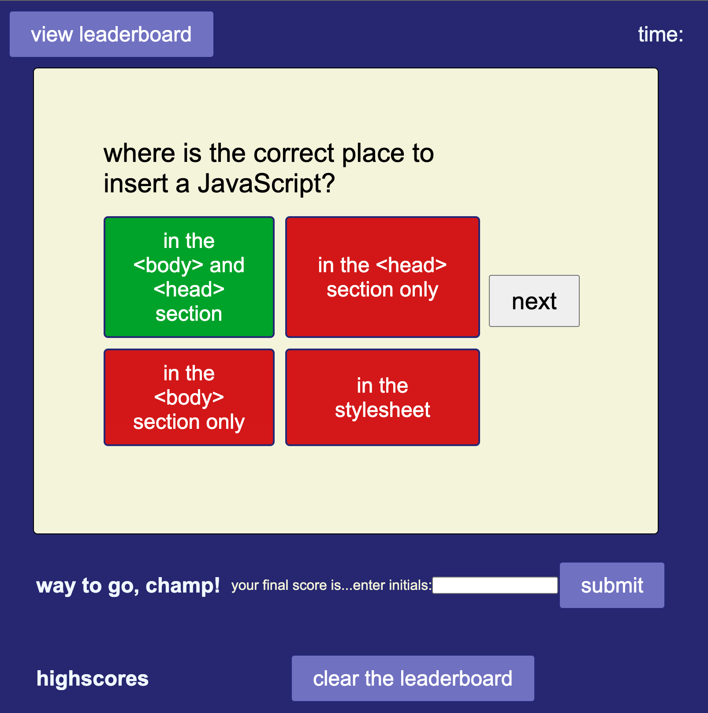

# 04 Javascript Quiz

## Description

The goal of this project was to create a quiz that would test some basic knowledge over JavaScript. Developers can test their memory and improve their understanding by seeing how familiar they really are with JavaScript. 

In this challenge, I learned how to dynamically alter elements utilizing event listeners and structure a simple web application's files.

## Installation

This application will be deployed utilizing github pages. The link should be provided on the right hand side of the github repository.

## Usage

Utilizing clicks, user can get through the quiz due to its intuitive design.

Example images are below:

## Credits

Web Dev Simplified: https://youtu.be/riDzcEQbX6k

Stack Overflow Reference for timer: https://stackoverflow.com/questions/58964755/subtract-time-from-timer-if-answer-is-wrong-creating-a-quiz-javascript

## Note

any and all feedback is appreciated (needed). really would like some direction with the timer/subtraction of time and leaderboard/how to dynamically change that element